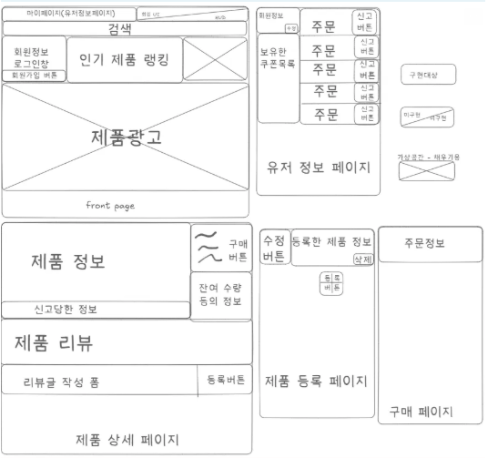
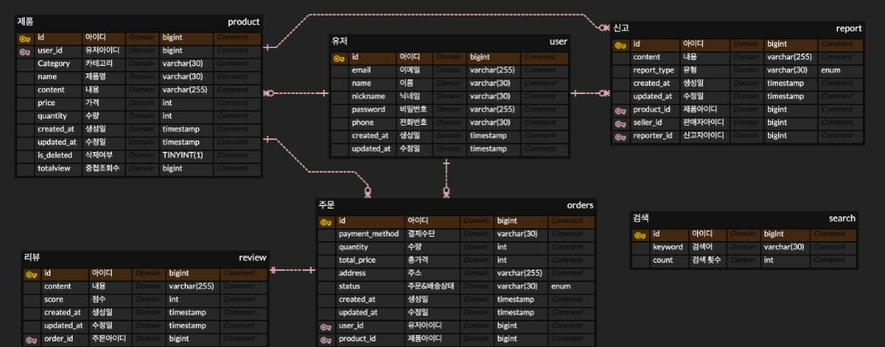

# 🛒 전자 상거래 API 캐시 성능 개선 프로젝트

## 📌 프로젝트 개요

전자 상거래 시스템의 **검색 성능 향상과 동시성 제어 최적화**를 위한 API 개선 프로젝트입니다.

### 🎯 목표

- **캐싱을 통한 검색 성능 개선**
    - v1 → v2 (메모리 캐시) → v2 (Redis 적용)

- **검색 최적화 및 인덱싱 적용**
  (Indexing 기반 성능 최적화)

- **동시성 제어 기능 구현**
    - 인기 검색어 집계와 같은 다중 사용자 검색 기능
    - 주문 시 제품 재고 감소 등 트랜잭션 충돌 방지

### 🧩 핵심 도메인

- **User**
- **Product**
- **Order**
- **Review**
- **Report**
- **Search**

---

## 👨‍👩‍👧‍👦 담당 업무

- **한정남** : 주문(Order) 도메인 / 동시성 제어
- **김채원** : 유저(User) 도메인 및 인증 인가 / 인기 검색어 캐싱 처리
- **박민규** : 신고(Report) 도메인 / 인덱싱
- **최성원** : 리뷰(Review) 도메인 / 인덱싱, 로컬 캐싱
- **김지환** : 제품(Product) 도메인 / 제품 조회 수 캐싱

---

## 🗂️ 와이어 프레임

---
## 🗂️ ERD

---
## 🗂️ API
[API 문서 보기](https://teamsparta.notion.site/1f52dc3ef5148052826df0b278eb7443?v=1f52dc3ef51481ca94ce000cf0c69f31)

---

## 🛠 기술 스택

#### 데이터베이스 / 캐시
- Redis
- MySQL 
- Caffeine
#### 개발환경
- SpringBoot
- IntelliJ
- Docker
#### 테스트 도구
- nGrinder
- Postman
- JUnit5

---

## 📈 버전 흐름
- **v1**: 기본 검색 기능
- **v2**: 메모리 캐시 + Redis 기반 캐시
---

